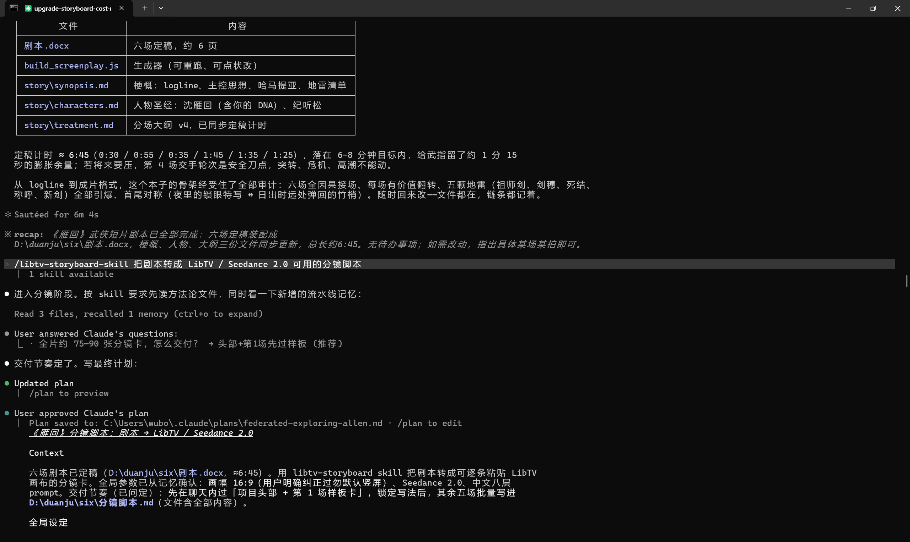
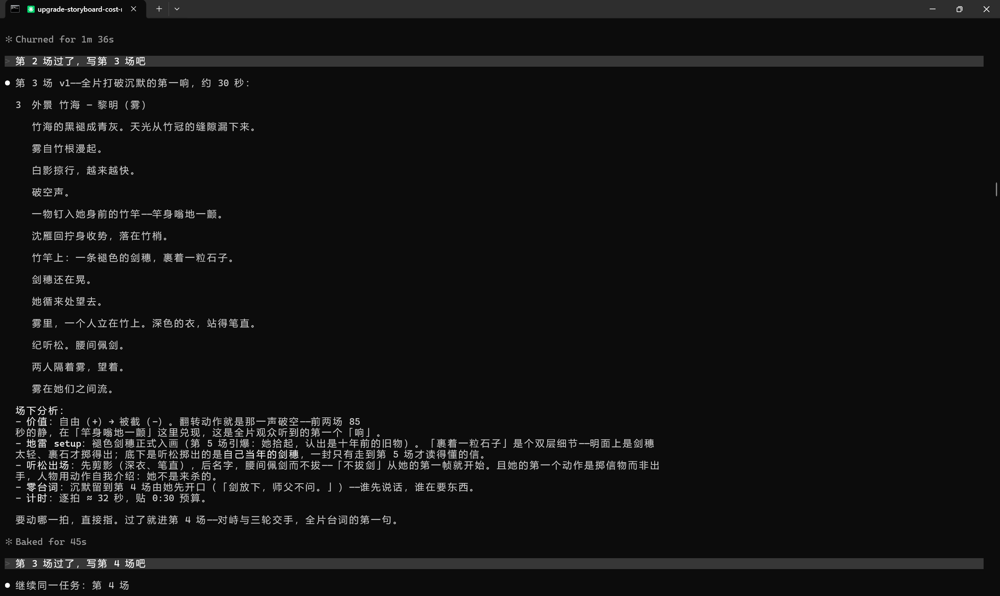
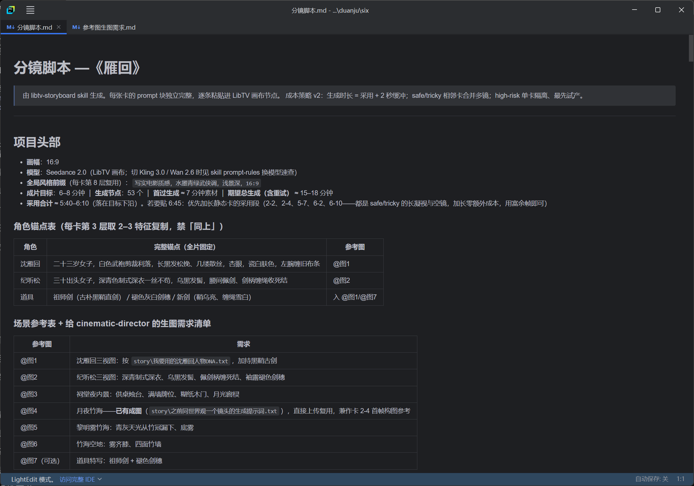
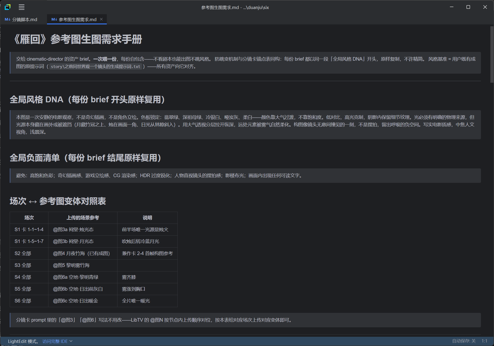

# 小优AIGC · AI 影视创作工作流

从一个想法，到完整故事，再到电影分镜和视觉方案。

```
一句话想法
   ↓
✍️  编剧 Skill（story-architect）
   ↓
🎬  分镜 Skill（libtv-storyboard）
   ↓
📷  视觉导演 Skill（cinematic-director）
   ↓
电影级图片 / 视频
```

本仓库是抖音 **「小优AIGC」** 的官方分发仓库。

## 🤝 交流与合作

欢迎交流 AI 创作流程、Skill 开发与 AIGC 工作流实践。

如果你在使用中遇到：不知道怎么改成自己的场景、想定制自己的创作流程、想搭建自己的 AI 工作流——

微信：**bbovoqaq666**（备注"剧组"）

> ⚠️ 这是唯一官方联系方式，其他任何渠道均为冒充，谨防受骗。

## ✨ 项目介绍

普通的 AI 生图，是雇了一个画师：你描述，它画，画成什么样看运气。

这个仓库给你的，是一整个剧组——编剧、分镜导演、摄影指导、美术指导。

你只说一句话，它们接力工作，把你的想法一步步变成电影级的画面。

## 🧩 Workflow

### 01 · 编剧 —— story-architect

把一个简单想法扩展成完整的故事框架。

负责：人物设定 · 世界观 · 冲突设计 · 三幕结构 · Hollywood 格式剧本（.docx 导出）

实测：一句话「帮我想一个武侠题材的剧本」，从大纲问答到六场剧本定稿——





### 02 · 分镜 —— libtv-storyboard

把故事拆成影视化镜头（LibTV / Seedance 2.0 可直接使用）。

负责：景别 · 运镜 · 首尾帧衔接 · 逐镜提示词 · 成本策略 · 风险分级

剧本进去，出的是能逐条粘贴进画布的分镜脚本，和交给视觉导演的参考图资产手册——





> **获取方式**：编剧和分镜这两个 Skill 不放公开下载，文件由我本人一对一发送——加微信（见上方「交流与合作」，备注「剧组」），顺便带你把环境配到能跑通第一个剧本。

### 03 · 视觉导演 —— cinematic-director（本仓库）

把镜头变成电影摄影级的生图提示词（模拟摄影团队开会决策）。

负责：摄影语言 · 光影 · 构图 · 色板 · 正向 + 负向 Prompt

> 只想生图：cinematic-director 就在本仓库，下载即用。想跑通整条流水线（想法→剧本→分镜→画面），编剧与分镜的获取见上方。

## 📦 下载（三步）

1. 点击本页右上方绿色的 **Code** 按钮
2. 选择 **Download ZIP**
3. 解压后，先打开 **《零基础上手教程.txt》**——从装软件到出第一张图，一步一图，完全没碰过命令行也能跟着走完

## 📄 包里有什么

| 文件 | 说明 |
|---|---|
| `cinematic-director/` | 视觉导演：引擎 + 全套工作手册（人物设计、镜头策略、场景模板……） |
| `零基础上手教程.txt` | 从零开始的完整教程，装软件到出图约 15 分钟 |
| `安装说明.txt` | 三步安装速查 |
| `skill.md` | 单文件版（仅生图）：不装 Agent 的话，粘进 chatGPT、deepseek、豆包 也能用（简化版效果） |

Skill 可装入 Claude Code / Codex / Hermes 等 AI Agent，拷贝文件夹即完成安装。

## 🔄 更新

这套工作流会越用越强——拍得好的经验，会写进它自己的手册里。

想拿最新版：回到本页，重新 Download ZIP，覆盖旧文件夹即可。
